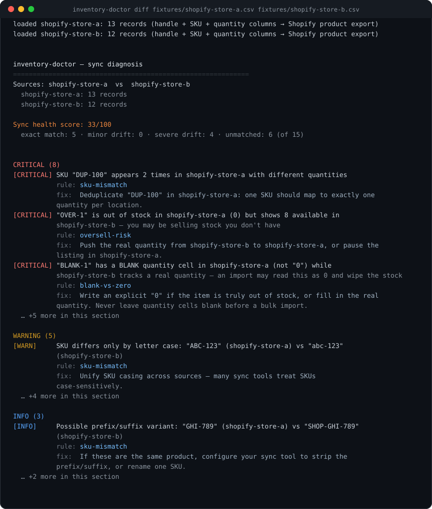
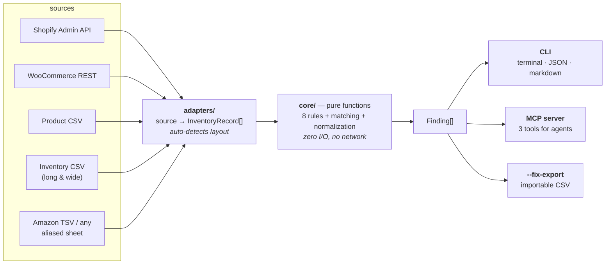

<div align="center">

# inventory-doctor

**Find the SKUs you're overselling without knowing it.**

Compare two inventory snapshots — CSV exports or live Shopify / WooCommerce stores — and get a report of everything that doesn't line up.

[](https://github.com/shidesheng0218/inventory-doctor/actions/workflows/ci.yml)
[](https://www.npmjs.com/package/inventory-doctor)
[](LICENSE)
[](package.json)
[](#mcp-server--use-it-from-claude-code-and-other-agents)
[](CONTRIBUTING.md)

<a href="fixtures/expected-report.md"></a>

<sub>Real output, not a mock-up — every line above is produced by <code>inventory-doctor diff</code> on the fixtures in this repo, and the full report is committed as <a href="fixtures/expected-report.md">fixtures/expected-report.md</a>, verified by the test suite.</sub>

</div>

---

## Why this exists

**Not a sync tool — an auditor for sync tools.** Trunk, Syncio, Synkro and friends *write* to your inventory (and their own reviews show they sometimes get it wrong). inventory-doctor never writes anything: it is the independent, read-only reconciliation layer you run alongside whatever sync app you use.

**Your data never leaves your machine.** CSV files are parsed locally; Shopify API calls go directly from your computer to your own stores over HTTPS. No server, no telemetry, no upload, no account.

The whole comparison is a pure function — `(records) => findings` — so you can read exactly what is being judged. See [docs/competitive-analysis.md](docs/competitive-analysis.md) for the full comparison.

## Who this is for

| | |
| --- | --- |
| **Developers & agencies** | Run the engine directly. The CLI and the MCP server *are* the diagnostic core — MIT, no account, no service in the middle. Wire `snapshot save` + `snapshot check` into your own cron or CI and you own the schedule. |
| **Merchants & teams who'd rather not run infrastructure** | The same engine behind a hosted app (in development): it schedules the daily check, keeps the history, compares the store against a 3PL/ERP export, and alerts when something breaks. |

The split is deliberate and one-way: the engine stays open so you can audit exactly what is being judged and run it yourself; the hosted app adds the boring parts (scheduling, storage, alerting, multi-source plumbing).

## Quick start

**Zero credentials — two CSV exports you already have:**

```bash
npx -y inventory-doctor diff store-a.csv store-b.csv
```

Exit code is `1` when critical findings exist, so this drops straight into CI or cron.

**From source (to hack on the engine):**

```bash
git clone https://github.com/shidesheng0218/inventory-doctor
cd inventory-doctor && npm install        # or: pnpm install
npm run build                             # produces dist/cli.js (with shebang)
node dist/cli.js diff fixtures/shopify-store-a.csv fixtures/shopify-store-b.csv
```

## What you can diagnose depends on what you have

This is the single most useful thing to know before you start:

| What you have | Rules that can fire |
| --- | --- |
| **One store, one snapshot** | `oversold` — negative availability, i.e. orders already accepted for stock that isn't there |
| **One store over time** (≥3 saved snapshots) | + `nightly-zero` — "stocked for days, then reads 0", the silent-wipe pattern |
| **Two systems** (Shopify vs 3PL / ERP / marketplace export) | + `sku-mismatch`, `barcode-crosscheck`, `quantity-drift`, `untracked`, and the cross-source half of `oversell-risk` |
| **Two systems, both carrying locations** | + location-level drift and stockouts, compared per (SKU, location) |

Two *different systems* means exactly that. Comparing a store against yesterday's export of the same store makes each day a "source" — a SKU that legitimately sold out gets reported as a critical oversell emergency. Use `snapshot check` for one store over time; use `diff` for two systems.

## The eight rules

| Rule | What it catches | Severity |
| --- | --- | --- |
| `sku-mismatch` | Case-only / whitespace / prefix-suffix SKU variants, orphan SKUs, one-to-many duplicates within one source | info → critical |
| `oversell-risk` | Quantity ≤ 0 on one side but > 0 on the other; "continue selling when out of stock" with empty stock; drift beyond threshold | warning → critical |
| `oversold` | Negative available quantity — orders already accepted for stock that does not exist. Needs no second source, so a single store gets this on day one | critical |
| `blank-vs-zero` | A **blank** quantity cell vs an explicit `0` — the classic "bulk import wiped my inventory" root cause | critical |
| `barcode-crosscheck` | Same barcode, different SKUs across sources — silent mapping misconfiguration | critical |
| `quantity-drift` | Overall sync health: % exact / minor drift / severe drift / unmatched → health score 0–100 | info |
| `untracked` | Inventory tracking disabled in one source while another manages stock | info |
| `nightly-zero` | Time-series across saved snapshots: a SKU with a stable positive history suddenly reading 0 ("silently zeroed overnight"), vanishing, or dropping suspiciously fast | warning → critical |

**Blank vs `0` is a first-class distinction.** CSV parsers love turning empty cells into 0; this tool keeps `quantity: null` strictly separate from `quantity: 0` all the way through.

### Multi-location aware

When both sources carry a location dimension (inventory CSV long/wide format, or the API), quantities are compared per *(SKU, location)*: a location-level stockout or drift is reported at that location and never hidden by summing across locations, and a SKU stocked at two locations is **not** mistaken for a duplicate. When one side has no location dimension (product CSV), its per-SKU quantity is compared against the other side's cross-location sum.

Worked examples: [`fixtures/shopify-inventory-c.csv`](fixtures/shopify-inventory-c.csv) / [`-d.csv`](fixtures/shopify-inventory-d.csv) (long format) and [`fixtures/shopify-inventory-wide-e.csv`](fixtures/shopify-inventory-wide-e.csv) / [`-f.csv`](fixtures/shopify-inventory-wide-f.csv) (wide format).

## Fix export — from finding to fix

`--fix-export` turns critical findings into a Shopify-importable inventory CSV that brings the **second** source in line with the **first** (the source of truth):

```bash
inventory-doctor diff a.csv b.csv --fix-export fix.csv
# → fix direction: bring "b" in line with "a" (first source = source of truth)
# → review fix.csv, verify it, then import it into b
```

> **Watch the direction.** With mixed flags the "first" source is not necessarily the first flag you typed — precedence is: positional files, then `--csv`, then `--store`/`--woo`, then `--baseline`. The run always prints the direction before writing, so check that line.

The tool never writes to any API. The fix is a file you can read, diff, and re-check before importing — the run prints the exact verify command (`inventory-doctor diff <truth-source> fix.csv`), so you can prove the fix would heal the report first. An auditable fix, not a silent mutation. Critical findings that an inventory import cannot fix (e.g. a SKU missing from the target entirely) are called out explicitly instead of being silently dropped.

## Snapshots — time-series diagnosis

A single diff compares two snapshots taken now. Saving snapshots over time unlocks the time-series rule (`nightly-zero`): "this SKU was in stock every day and suddenly reads 0" — the silent-wipe pattern a one-off diff cannot see.

```bash
inventory-doctor snapshot save store-a.csv                             # or a configured store: store:store-a
inventory-doctor snapshot list shopify-store-a
inventory-doctor snapshot check shopify-store-a                        # needs ≥3 snapshots; exit 1 on critical

inventory-doctor diff now.csv --baseline shopify-store-a               # against the latest snapshot
inventory-doctor diff now.csv --baseline shopify-store-a@2026-09-01    # against a specific one
```

Snapshots live as local JSONL files under `~/.local/share/inventory-doctor/snapshots/<name>/` (override with `INVENTORY_DOCTOR_SNAPSHOT_DIR`). Put `snapshot save` + `snapshot check` on a cron and you have daily reconciliation with no service in the middle and no account.

**Give the check a window.** History can be as long as you like, but the rule only needs the recent past, and every loaded record costs memory (~300 bytes, measured):

```bash
inventory-doctor snapshot check shopify-store-a --window 30
```

A year of daily snapshots of a 5,000-SKU shop is ~0.5 GB on disk; loading all of it would need ~510 MB of RAM. With `--window 30` the run stays around 45 MB however long the history grows. The listing itself is cheap either way — only the snapshots inside the window are read.

## Supported inputs

| Input | Notes |
| --- | --- |
| **Shopify product CSV** | Both header generations (`Variant SKU` *and* the current `SKU`, `Variant Inventory Qty` *and* `Inventory quantity`, …) |
| **Shopify inventory CSV** | Both layouts: the long "All states" table (one row per variant × location) and the wide "Available" table (location names as column headers, inferred automatically) |
| **Amazon-style / anything else** | Alias-based column probing (`seller-sku` / `quantity` TSVs work out of the box), plus explicit mapping when guessing fails |
| **Shopify Admin API** | Live snapshots, static token or client credentials — see below |
| **WooCommerce REST API** | Live snapshots — see below |

```bash
inventory-doctor diff shopify.csv erp.csv --map sku="Item Code" --map quantity="Stock Count"
```

SKU normalization (trim, case folding, full-width → half-width, zero-width character removal) is used **only for comparison** — reports always show your raw SKU values.

## Shopify Admin API (optional)

Pull live snapshots instead of exporting CSVs. Create `inventory-doctor.json` in the project directory (or `~/.config/inventory-doctor/config.json`):

```jsonc
{
  "stores": [
    // Mode 1: existing static token (shpat_... — still works if you already have one)
    { "name": "store-a", "domain": "a.myshopify.com", "accessToken": "env:STORE_A_TOKEN" },
    // Mode 2: client credentials grant (the current way to create app credentials)
    { "name": "store-b", "domain": "b.myshopify.com",
      "clientId": "env:STORE_B_CLIENT_ID", "clientSecret": "env:STORE_B_SECRET" }
  ]
}
```

Credentials support `"env:VAR_NAME"` references so secrets stay out of files. Then:

```bash
inventory-doctor diff --store store-a --store store-b   # store vs store
inventory-doctor diff --store store-a --csv b.csv       # mixed mode
```

The same file tunes the diagnostic rules (all optional; CLI flags win):

```jsonc
{
  "rules": {
    "disable": ["untracked"],                     // turn a rule off entirely
    "ignoreSkus": ["GIFT-*", "TEST-?"],           // glob vs canonical SKU — findings dropped
    "severityOverrides": { "blank-vs-zero": "warning" },
    "driftAbsThreshold": 10,                      // like --drift-abs
    "driftPctThreshold": 0.3                      // like --drift-pct
  }
}
```

Details that matter:

- API version pinned to **2026-07** (`/admin/api/2026-07/graphql.json`).
- Inventory is read via `quantities(names: [...])` — the old `InventoryLevel.available` field no longer exists.
- Tokens from client credentials live 24h; they're cached and refreshed 60s early, not re-requested per call.
- Every HTTP request has a 30s timeout, and transient network failures (reset, DNS, timeout) are retried with the same 1s backoff as rate limits — a hung store cannot hang the run.
- Rate limiting is **adaptive**: every response's `extensions.cost.throttleStatus.currentlyAvailable` drives a slow-down before the bucket empties; HTTP 429 / `THROTTLED` backs off 1s and retries. No plan-specific rate numbers are hardcoded.
- Read-only scopes only: `read_inventory`, `read_products`, `read_locations`.

**Client credentials limitation:** the app and the store must belong to the **same Shopify org**. That covers "a merchant building a tool for their own store". Agencies managing client stores get `shop_not_permitted` from client credentials — use the OAuth flow below instead.

## Shopify OAuth (agency / cross-org)

One-time browser flow per store. Prerequisite: a Dev Dashboard app with a loopback redirect URL (`http://127.0.0.1`) registered — see Shopify's OAuth docs.

```bash
inventory-doctor auth client-store.myshopify.com --client-id ... --client-secret ...
```

This opens the consent screen, exchanges the code for an **offline token** (never expires), and saves it to `~/.config/inventory-doctor/oauth-tokens.json` (mode 0600) — not to your project config. Then reference it with `"oauth": true`:

```jsonc
{ "name": "client-store", "domain": "client-store.myshopify.com", "oauth": true }
```

## WooCommerce (REST API)

Add a `woocommerce` section to `inventory-doctor.json` (consumer key/secret from WooCommerce → Settings → Advanced → REST API):

```jsonc
{
  "woocommerce": [
    { "name": "woo-shop", "baseUrl": "https://shop.example.com",
      "consumerKey": "env:WOO_CK", "consumerSecret": "env:WOO_CS" }
  ]
}
```

Then `woo:<name>` works everywhere a source is accepted:

```bash
inventory-doctor diff --store store-a --woo woo-shop   # Shopify vs WooCommerce
inventory-doctor diff woo-shop-export.csv --woo woo-shop
```

Notes: HTTPS is enforced (Basic Auth over plain HTTP would leak credentials). `manage_stock: false` maps to "tracking off" (the `untracked` rule fires as usual), and `backorders: yes/notify` maps to "continue selling when out of stock". WooCommerce core has no multi-location inventory, so Woo sources have no location dimension.

## MCP server — use it from Claude Code and other agents

Add to your `.mcp.json`:

```json
{
  "mcpServers": {
    "inventory-doctor": {
      "type": "stdio",
      "command": "npx",
      "args": ["-y", "inventory-doctor", "mcp"],
      "env": { "SHOPIFY_CLIENT_SECRET": "${SHOPIFY_CLIENT_SECRET}" }
    }
  }
}
```

Three tools are registered:

| Tool | What it does |
| --- | --- |
| `diff_inventory(sourceA, sourceB, configPath?, maxFindings?)` | Full diagnosis, returns the JSON report. Findings are capped at `maxFindings` (default 100) so a large catalogue cannot flood the agent's context; on truncation the payload carries `totalFindings` and points at `explain_sku` for the remainder. |
| `explain_sku(sku, sources, configPath?)` | One SKU's raw values and findings across all sources (for follow-up questions). |
| `inventory_health(sources, configPath?)` | Lightweight health-score summary. |

Every source argument accepts a **CSV file path**, **`store:<name>`** (a store from `inventory-doctor.json`, credentials resolved from env vars), or **`snapshot:<name>[@<id>]`** (a saved snapshot) — so an agent can diff two live stores, or a store against a CSV, in one call. `configPath` is only needed when the config file is not in a default location.

stdout is reserved for JSON-RPC; all logging goes to stderr (guarded by `npm run check:stdout`).

## Honest limitations

- **Time-series needs saved snapshots.** `snapshot check` detects silent zeroing across history, but only over snapshots you actually saved — it cannot reconstruct the past before the first save.
- **WooCommerce has no multi-location inventory** in core; per-location diagnosis on that side needs a CSV export from a multi-location plugin instead.
- **Amazon report headers vary** by marketplace and report options; detection is best-effort via column aliases, and `--map` is the escape hatch.
- **Product CSVs carry no per-location inventory**; multi-location diagnosis needs the inventory CSV export or the API.

## Architecture



`src/core/` is a pure-function diagnostic kernel (`(records: InventoryRecord[]) => Finding[]`, zero I/O); `src/adapters/` turns CSVs and APIs into that intermediate representation; the CLI and MCP layers only parse arguments and format output. **Adding a new source means adding one adapter — no refactor.**

## Development

```bash
npm test             # vitest — rules, CSV adapters, token cache, throttle logic
npm run dev -- diff fixtures/shopify-store-a.csv fixtures/shopify-store-b.csv
npm run build        # tsc + shebang
npm run check:stdout # guards the MCP stdout discipline
```

CI runs the suite on Node 22 and 24. Contributions welcome — see [CONTRIBUTING.md](CONTRIBUTING.md).

## License

[MIT](LICENSE) — use it, fork it, ship it inside your own product.
